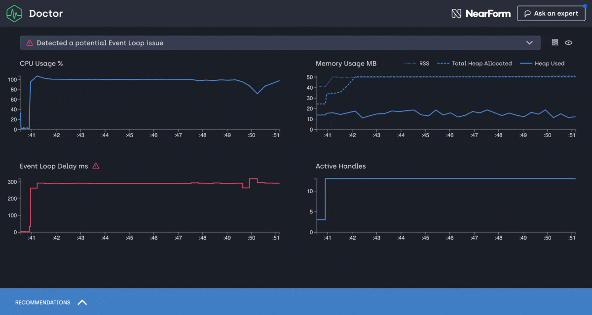

# Clinic.js

[](https://greenkeeper.io/)
[![npm version][npm-version]][npm-url] [![Stability Stable][stability-stable]][stability-docs] [![Azure build status][azure-status]][azure-url]
[![Downloads][npm-downloads]][npm-url] [![Code style][lint-standard]][lint-standard-url]

An Open Source Node.js performance profiling suite originally developed by [NearForm][].

Demo and detailed documentation: https://clinicjs.org/

## Install

```
npm install -g clinic
```

<br />



## Getting started

As a first step, run the `clinic doctor`:

`clinic doctor -- node server.js`

Then benchmark your server with `wrk` or `autocannon`:

```
wrk http://localhost:3000
autocannon http://localhost:3000
```

If you want to run autocannon as soon as your server starts listening you can
use the `--autocannon` option using [subarg][] syntax.

```sh
clinic doctor --autocannon [ / --method POST ] -- node server.js
```

Other benchmarking tools like wrk can be started in a similar way using the `--on-port` flag

```sh
# $PORT is the port the server is listening on
clinic doctor --on-port 'wrk http://localhost:$PORT' -- node server.js
```

Finally shut down your server (Ctrl+C). Once the server process has shutdown
`clinic doctor` will analyse the collected data and detect what type of issue
you are having. Based on the issue type, it will provide a recommendation for
you.

For example, to debug I/O issues, use `clinic bubbleprof`:

```
clinic bubbleprof -- node server.js
```

Then benchmark your server again, just like you did with `clinic doctor`.

Note that when looking at the CPU graph you might notice that it doesn't
necessarily go from 0-100 but might go from 0-200 or higher. This is because the
percentage reflects the total amount of CPU cores your computer has. Node.js
itself uses more than one thread behind the scene even though JavaScript is
single threaded. V8 (The JavaScript engine) runs the garbage collector and some
optimizations on background threads. With worker threads, the CPU will also
utilize more than 100%. The visible percentage is always the combination of all
these factors together.

__NOTE__: Exiting the process forcefully can result in wrong or no generation of log files.

### Windows + PowerShell

In order to diagnose your application with node clinic, you should execute your application after double hyphens(`--`),
e.g: `clinic doctor -- node myapplication.js`.

On Windows using PowerShell as terminal the above statement might not work because PowerShell parses everything after `--`
as literal arguments instead of options.

To avoid that behavior you can either quote ("--", '--') or escape (`--`) the double hyphens.

## Supported Node.js versions

Clinic.js relies heavily on Node.js core instrumentation available in later versions.
Currently the supported Node.js versions are `>= 16`.

## Examples and Demos

- [A set of simple Doctor examples](https://github.com/clinicjs/node-clinic-doctor-examples)
- [A set of simple Bubbleprof examples](https://github.com/clinicjs/node-clinic-bubbleprof-examples)
- [A MongoDB-based Bubbleprof demo/example](https://github.com/clinicjs/node-clinic-bubbleprof-demo)
- [A Flame demo/example](https://github.com/clinicjs/node-clinic-flame-demo)

## Report an issue

If you encounter any issue, feel free to send us an issue report at:

```
https://github.com/clinicjs/node-clinic/issues
```

## More information

For more information use the `--help` option:

```
clinic doctor --help
clinic bubbleprof --help
clinic flame --help
clinic heapprofiler --help
```

- The `doctor` functionality is provided by [Clinic.js Doctor](https://github.com/clinicjs/node-clinic-doctor).
- The `bubbleprof` functionality is provided by [Clinic.js Bubbleprof](https://github.com/clinicjs/node-clinic-bubbleprof).
- The `flame` functionality is provided by [Clinic.js Flame](https://github.com/clinicjs/node-clinic-flame).
- The `heapprofiler` functionality is provided by [Clinic.js Heap Profiler](https://github.com/clinicjs/node-clinic-heap-profiler).

## Flags

```
-h | --help                Display Help
-v | --version             Display Version
--collect-only             Do not process data on termination
--visualize-only datapath  Build or rebuild visualization from data
--on-port                  Run a script when the server starts listening on a port.
--autocannon               Run the autocannon benchmarking tool when the server starts listening on a port.
--dest                     Destination for the collect data (default .).
--stop-delay               Add a delay to close the process when a job is done through either `autocannon` or `on-port` flag (milliseconds)
--name                     The --name flag sets a name for the output data, allowing you to replace existing reports without generating new ones. Example: <code>.clinic/node-19-test.clinic-flame</code>
```

## Programmable Interfaces

Each of the tools has a programmable interface which you can read about in their repos.

- [Clinic.js Doctor](https://github.com/clinicjs/node-clinic-doctor)
- [Clinic.js Bubbleprof](https://github.com/clinicjs/node-clinic-bubbleprof)
- [Clinic.js Flame](https://github.com/clinicjs/node-clinic-flame)
- [Clinic.js Heap Profiler](https://github.com/clinicjs/node-clinic-heap-profiler)

## Profiling In [Podman](https://podman.io/) Container
_Applicable for `doctor`, `bubbleprof`, `flame` or `heapprofiler`_

In case you profile your application inside of container environment using [podman](https://podman.io/) (docker alternative).
And you start profling by providing `CMD` step in the dockerfile.
```
CMD clinic flame -- node index.js
```
Then when you run container it exits immediately with `0` code.
It is caused by a [question to collect anonymous usage statistics](https://github.com/clinicjs/node-clinic/issues/79#issuecomment-1226515723).

A workaround is to use environment variable `NO_INSIGHT` with any value.
In this case the question to collect anonymous usage statistics is suppressed. Thus profinling and application server start as expected.
```
CMD NO_INSIGHT=true clinic flame -- node index.js
```

## License

[MIT](LICENSE)

[stability-stable]: https://img.shields.io/badge/stability-stable-green.svg?style=flat-square
[stability-docs]: https://nodejs.org/api/documentation.html#documentation_stability_index
[npm-version]: https://img.shields.io/npm/v/clinic.svg?style=flat-square
[npm-url]: https://npmjs.org/package/clinic
[npm-downloads]: http://img.shields.io/npm/dm/clinic.svg?style=flat-square
[lint-standard]: https://img.shields.io/badge/code%20style-standard-brightgreen.svg?style=flat-square
[lint-standard-url]: https://github.com/feross/standard
[azure-status]: https://dev.azure.com/node-clinic/node-clinic/_apis/build/status/nearform.node-clinic
[azure-url]: https://dev.azure.com/node-clinic/node-clinic/_build/latest?definitionId=1?branchName=master
[nearform]: https://www.nearform.com
[subarg]: https://npmjs.com/package/subarg
